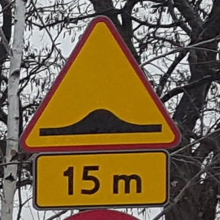

# Traffic Sign Recognition

# Abstract 
TSR is an acronym for Traffic Sign Recognition.
Systems like that help drivers while riding in a car.
In this project I created one of my own and tried to improve him.
This war was more focusing on exploration and investigation of how to find the best setup.

## Technologies
- Python
- OpenCV
- TensorFlow
- Keras

## Description
The main idea of this system was to investigate whether a system which is based on more than one camera and has a segmentation algorithm can improve sign recognition.

### Recording
Current system uses videos from three cameras. 
First one is located above drivers and records the road before him. 
Second camera is located on the right of the driver just above the head of the passenger and also records the road in front of the car.
Third one is on the right of the passenger and records the view on the front right corner of the car.
In the pictures below you can see views from cameras.

### Binding images
Next which this system did was binding the recording from all cameras together to create a panoramic view.
To do that it used the SIFT algorithm which finds key points and binds pictures based on them.
I also tried SURT and ORB algorithms but the first one consumes too much time for my purpose but the second one doesn't have enough accuracy.
Steps are shown in the pictures below.
Unfortunately binding videos caused the traffic signs which were distorted so I decided to not bind the video in my algorithm and process the pictures independently. 

### Segmentation
Next step was to find areas where the traffic signs can be located.
Mostly I use OpenVC library for if
The area where the traffic sign is located is called ROI.
For finding a ROI I decided to convert videos from RGB to HSV (hue, saturation, lightness) colour representation and maximalize Saturation.
The algorithm thresholding the picture in three different colours blue, red and yellow.
Below you can see effect of thresholding for yellow and red 
 

In the next step it was needed to add filters on these images.
To do that I use morphological operations like dilation and erosion.
Next algorithm search ROI by Blob detector.
Because most red traffic signs are circles I decided to find ROI for red signs by Hough Gradient.
In the end the algorithm cutted area where signs were detected from the original picture, resize it to one size and forward them to the classification algorithm.
Like you can see on some ROI there wasn't a traffic sign

### Classification
I've chosen parallel neural networks for classification and I've worked with TensorFlow to do that.
Because there were three independent ROI I decided to use 3 neutral networks, each for every colour.
The layers of the neutral network is described in the table below.

| Nr. | Type of leyers | Number of neurons | Activate fcn. |
| --- | --- | --- | --- |
| 1 | Conv2D | 64 | Relu |
| 2 | Flatten | - | - | 
| 3 | Dense | 64 | Relu |
| 4 | Dense | 64 | Relu |
| 5 | Dense | 32 | Relu |
| 6 | Dense | adapted | Softmax |

Conv2D means convolution layers based on two dimensions picture
Flatten is a layer which creates a one dimensional vector. Size of the vector is equal to the number of pixels.
Dense layer is a classical deep layer of neural network.
Relu activation function which activates itself only if the value will be the height of the seated threshold.
Neural network was learned by Adam neural network learning algorithm and Sparse Categorical
Cross Entropy for epochs. For the learning database I have used German Traffic Sign Recognition Benchmark (GTSRB) and almost tousend my own pictures.

### Results
Presented algorithm can recognize traffic signs. 
The level of detection was 20 % which bothered the neutral network. 
There was a lot of ROI which was given to neutral networks and it recognized it as a sign. 
Although the neural network works quite well because when I use it to recognize a single picture its accuracy was 80%.
All the systems have accuracy around 40%.
For sure there is a lot of space for further exploration.
The biggest advantage of building this system was learning about image processing and neural networks

